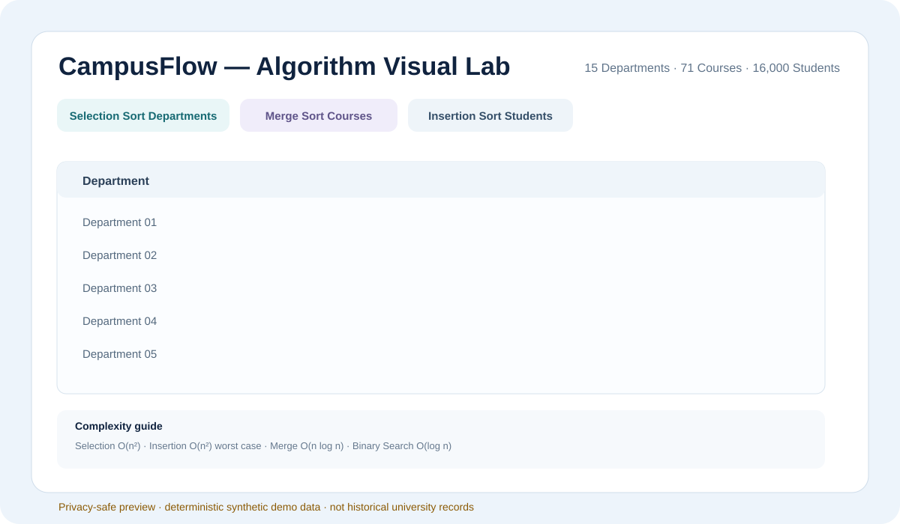

# CampusFlow — Algorithms & Java

[](https://github.com/KhaledSucceed/KhaledSucceed/actions/workflows/academic-projects-ci.yml)

**Course:** CSE112 — Design & Analysis of Algorithms  
**University:** Galala University  
**Status:** Evidence-based public reimplementation; original source package not recovered

A Java Swing college-management project demonstrating custom sorting/search algorithms, algorithm-to-domain mapping, Big-O awareness, and executable self-validation.



> **Data note:** the public reimplementation uses deterministic **synthetic demo data** matching the documented project scale. It is not original university data.

## Academic context

Recovered presentation evidence establishes CampusFlow as an algorithms-focused college-management system covering:
- departments, courses, and students;
- sorting and searching;
- Big-O / step execution;
- a GUI presentation layer.

## Provenance & status

| Item | Status |
|---|---|
| Recovered project/presentation evidence | Available privately |
| Historical source ZIP / `CampusFlowFinal.java` | Not recovered |
| Public Java implementation | Clean reimplementation |
| Original CSV data | Not recovered |
| Public demo data | Deterministic synthetic data |
| Compile / self-test | Validated |

→ [Full provenance record](PROJECT_PROVENANCE.md)

## Implementation

- Java Swing desktop UI
- Selection Sort → departments by name
- Merge Sort → courses by enrolled-student count
- Insertion Sort → students by GPA
- Binary Search → department name
- Binary Search → student ID
- complexity guide in the UI
- deterministic `--selftest` mode

## Validation

Validated locally and continuously in GitHub Actions:
- Java 21 compile: **PASS**
- Selection Sort: **PASS**
- Merge Sort: **PASS**
- Insertion Sort: **PASS**
- department Binary Search: **PASS**
- student-ID Binary Search: **PASS**
- 15 / 71 / 16,000 synthetic-scale check: **PASS**
- GUI startup smoke test: **PASS**
- overall self-test: **PASS**

→ [Validation record](VALIDATION.md)

## Build & run

```bash
javac -d out src/CampusFlowFinal.java
java -cp out CampusFlowFinal --selftest
java -cp out CampusFlowFinal
```

## Limitations

- The historical source package is not available.
- The original CSV files are not available.
- The visual above is a privacy-safe UI preview of the validated public reimplementation, not recovered historical evidence.

## Links

→ [Case study](../campusflow.md)  
→ [Validation](VALIDATION.md)  
→ [Provenance](PROJECT_PROVENANCE.md)
