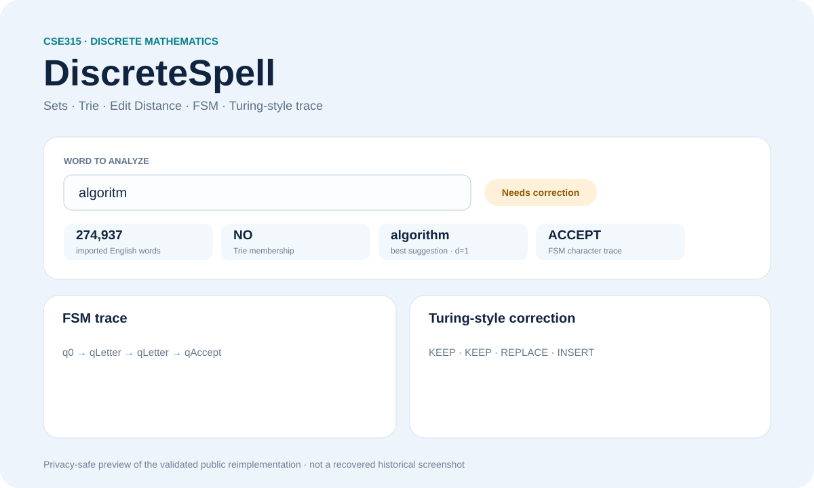

# DiscreteSpell — Discrete Mathematics Software

[](https://github.com/KhaledSucceed/KhaledSucceed/actions/workflows/academic-projects-ci.yml)

**Course:** CSE315 — Discrete Mathematics  
**University:** Galala University  
**Status:** Evidence-based public reimplementation; original source package not recovered

A React/Vite spell-checker and visual lab that maps dictionary membership, Trie search, edit distance, finite-state traces, and Turing-style correction steps to discrete-mathematics concepts.



## Academic context

Recovered project material confirms the CSE315 Spell Checker / DiscreteSpell project and preserves privacy-sensitive UI/presentation evidence in the private academic archive.

## Provenance & status

| Item | Status |
|---|---|
| Recovered project/UI evidence | Available privately |
| Historical React/Vite source ZIP | Not recovered |
| Public implementation | Clean reimplementation |
| Imported English dictionary | 274,937 words |
| Automated tests | 24 / 24 PASS |
| Dependency audit | 0 vulnerabilities |
| Production build | PASS |

→ [Full provenance record](PROJECT_PROVENANCE.md)

## Implementation

- React + Vite
- Vitest automated testing
- imported English dictionary
- custom Trie / prefix-tree membership
- custom Levenshtein edit distance
- deterministic suggestion ranking
- finite-state-machine character trace
- Turing-style correction trace
- discrete-mathematics course matrix

## Engineering improvement

The first build bundled the full dictionary into browser JavaScript and produced a main bundle of roughly **3.6 MB**.

The final implementation:
- generates **26 per-letter dictionary buckets** at build time;
- lazy-loads only the relevant letter bucket;
- retains **274,937 imported English words**;
- reduces the main production JS to **226.42 kB** (**71.02 kB gzip**).

## Validation

Validated locally and continuously in GitHub Actions:
- `npm audit`: **0 vulnerabilities**
- test files: **3 / 3 PASS**
- automated tests: **24 / 24 PASS**
- Vite production build: **PASS**
- production preview: **HTTP 200**

→ [Validation record](VALIDATION.md)

## Install, test & run

```bash
npm ci
npm test
npm run build
npm run dev
```

## Limitations

- The historical source ZIP is not available.
- The visual above is a privacy-safe preview of the validated public reimplementation, not a recovered historical screenshot.
- UI behavior is educational and is not intended to replace a production spell-checking service.

## Links

→ [Case study](../discretespell.md)  
→ [Validation](VALIDATION.md)  
→ [Provenance](PROJECT_PROVENANCE.md)
