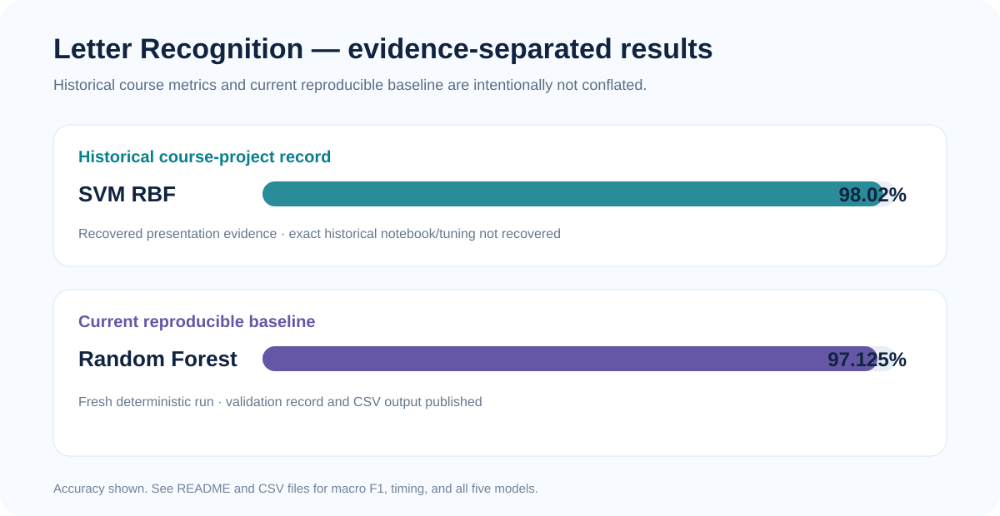

# Letter Recognition — Machine Learning Evaluation

[](https://github.com/KhaledSucceed/KhaledSucceed/actions/workflows/academic-projects-ci.yml)

**Course:** AIE121 — Machine Learning  
**University:** Galala University  
**Status:** Reproducible public reimplementation backed by recovered course-project evidence

A multiclass ML evaluation project comparing five model families on the UCI Letter Recognition dataset, with historical course results kept separate from the current reproducible baseline.



## Academic context

- Dataset: UCI Letter Recognition
- Samples: 20,000
- Features: 16 numerical features
- Classes: 26 capital letters (A–Z)
- Models: KNN, SVM RBF, Logistic Regression, MLPClassifier, Random Forest

## Provenance & status

| Item | Status |
|---|---|
| Original presentation evidence | Recovered |
| Historical documented metrics | Recovered |
| Original notebook / script | Not recovered |
| Public implementation | Clean reimplementation |
| Current reproducible run | Validated |

The recovered presentation recorded **98.02% test accuracy and macro F1 with SVM RBF**. The exact historical notebook, split, tuning choices, and random state were not recovered, so the public implementation intentionally reports its fresh baseline separately.

→ [Full provenance record](PROJECT_PROVENANCE.md)

## Historical vs. reproduced results

| Result set | Best model | Accuracy | Macro F1 |
|---|---|---:|---:|
| Historical course-project record | SVM RBF | **98.02%** | **98.02%** |
| Current reproducible baseline | Random Forest | **97.125%** | **97.115%** |

See:
- `results/documented_results.csv`
- `results/reproduced_results.csv`
- `VALIDATION.md`

## Implementation

The public pipeline:
1. downloads the UCI Letter Recognition dataset;
2. performs a deterministic stratified train/test split;
3. trains five model families;
4. records accuracy, macro F1, training time, and prediction time;
5. exports reproduced results to CSV.

## Validation

Local reproducibility run: **PASS**.  
CI adds a lightweight model-evaluation smoke test so future changes are checked automatically.

→ [Validation record](VALIDATION.md)

## Run

```bash
python -m venv .venv
pip install -r requirements.txt
python src/train_evaluate.py
```

On Windows PowerShell, activate the environment with `.\.venv\Scripts\Activate.ps1` before installing dependencies.

## Limitations

- The original notebook and exact historical hyperparameters were not recovered.
- Reproduced numbers are not presented as replacements for the historical course results.
- Timing values depend on hardware and runtime environment.

## Links

→ [Case study](../letter-recognition.md)  
→ [Validation](VALIDATION.md)  
→ [Provenance](PROJECT_PROVENANCE.md)
