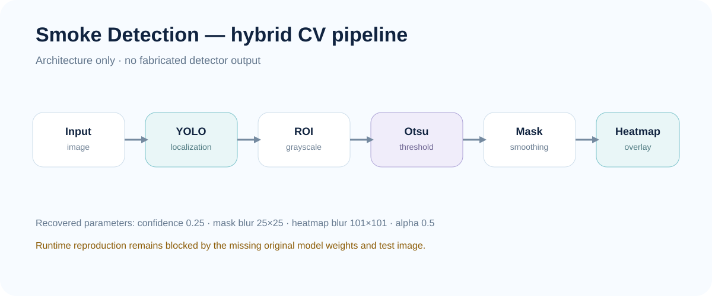

# Smoke Detection — Computer Vision Pipeline

[](https://github.com/KhaledSucceed/KhaledSucceed/actions/workflows/academic-projects-ci.yml)

**Course:** CSE281 — Image Processing  
**University:** Galala University  
**Status:** Recovered historical source + cleaned public implementation; full runtime reproduction pending original assets

A hybrid computer-vision pipeline combining YOLO-based smoke localization with ROI-level grayscale/Otsu processing and heatmap visualization.



## Academic context

The recovered implementation follows:

`input image → YOLO localization → ROI grayscale → Otsu thresholding → mask refinement → Gaussian smoothing → heatmap overlay`

## Provenance & status

| Component | Status |
|---|---|
| Historical Python source | Recovered as `original_recovered/main.py` |
| Clean CLI implementation | Published as `src/smoke_detection.py` |
| Original model weights | Missing |
| Original test image | Missing |
| Full runtime reproduction | Pending |
| Detector performance claims | Not made |

→ [Full provenance record](PROJECT_PROVENANCE.md)

## Recovered implementation details

- model filename: `firedetect-11x.pt`
- confidence threshold: `0.25`
- Python + OpenCV + NumPy + Ultralytics YOLO
- Otsu thresholding inside detector-produced regions
- mask smoothing kernel: `(25, 25)`
- heatmap smoothing kernel: `(101, 101)`
- alpha blending: `0.5`

## Implementation

- `original_recovered/main.py` preserves the recovered historical code.
- `src/smoke_detection.py` is a later cleaned CLI implementation with explicit paths, validation, and output handling.
- `models/README.md` and `test_images/README.md` document the missing runtime assets.

## Validation

Current validation is intentionally limited:
- Python source syntax: **PASS**
- synthetic heatmap unit test: checked by CI
- original end-to-end model execution: **blocked by missing weights/test image**

→ [Validation record](VALIDATION.md)

## Run

After providing an approved model and image:

```bash
python -m venv .venv
pip install -r requirements.txt
python src/smoke_detection.py \
  --model models/firedetect-11x.pt \
  --image test_images/smoke.jpg \
  --output output.jpg
```

## Limitations

No precision, recall, robustness, or detector-performance claim is made until a valid model and evaluation set are available. The pipeline visual above is an architecture diagram, **not a fabricated detector output**.

## Links

→ [Case study](../smoke-detection.md)  
→ [Validation](VALIDATION.md)  
→ [Provenance](PROJECT_PROVENANCE.md)
